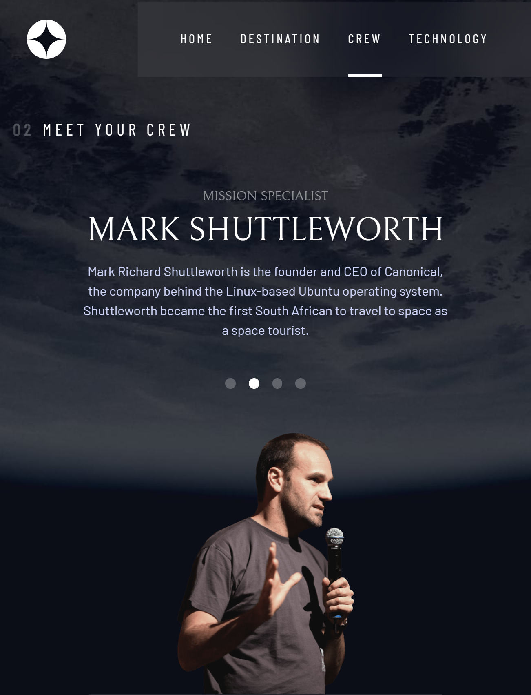
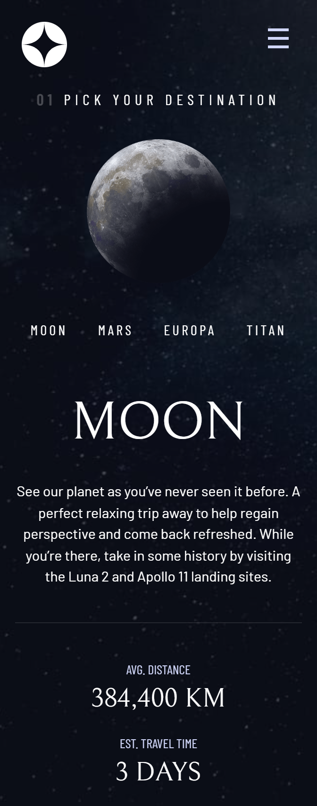

# Space tourism website

This is a solution to the [Space tourism website challenge on Frontend Mentor](https://www.frontendmentor.io/challenges/space-tourism-multipage-website-gRWj1URZ3). 

## Table of contents

- [Overview](#overview)
  - [The challenge](#the-challenge)
  - [Screenshot](#screenshot)
  - [Links](#links)
- [My process](#my-process)
  - [Built with](#built-with)
  - [What I learned](#what-i-learned)
  - [Useful resources](#useful-resources)

## Overview

### The challenge

Users should be able to:

- View the optimal layout for each of the website's pages depending on their device's screen size
- See hover states for all interactive elements on the page
- View each page and be able to toggle between the tabs to see new information

### Screenshot

### Links

- Solution URL: [Repository](https://github.com/davidbriseo/space-travel-website)
- Live Site URL: [Space Travel Website](http://davidbriseo.github.io/space-travel-website)

## My process

### Built with

- Semantic HTML5 markup
- CSS custom properties
- Flexbox
- CSS Grid
- Mobile-first workflow
- [React](https://reactjs.org/) - JS library
- [React Router v6](https://reactrouter.com/) - React framework

### What I learned

- This project main purpose is to practice React Router and heavy CSS formating. 
- React Router has launched its version 6, so this was an opportunity to learn its new features.

### Useful resources

- [A Modern CSS Reset](https://andy-bell.co.uk/a-modern-css-reset/) - CSS Reset code to make sure we work around some minor CSS issues from the start.
- [A Complete Guide to CSS Grid](https://css-tricks.com/snippets/css/complete-guide-grid/) - This helped me to refresh CSS Gid concepts and have a quick visual aide. 
- [A Complete Guide to Flexbox](https://css-tricks.com/snippets/css/a-guide-to-flexbox/) - This helped me to refresh CSS Flexbox concepts and have a quick visual aide.
- [Deploying React apps to GitHub Pages](https://blog.logrocket.com/deploying-react-apps-github-pages/) - Steps to correctly deploy a basic React App to GH Pages.
- [How to Deploy a Routed React App to GitHub Pages](https://www.freecodecamp.org/news/deploy-a-react-app-to-github-pages/) - React Apps posted to Github Pages with routing need some extre configuration, this article gave the basic idea of what is the issue. 
